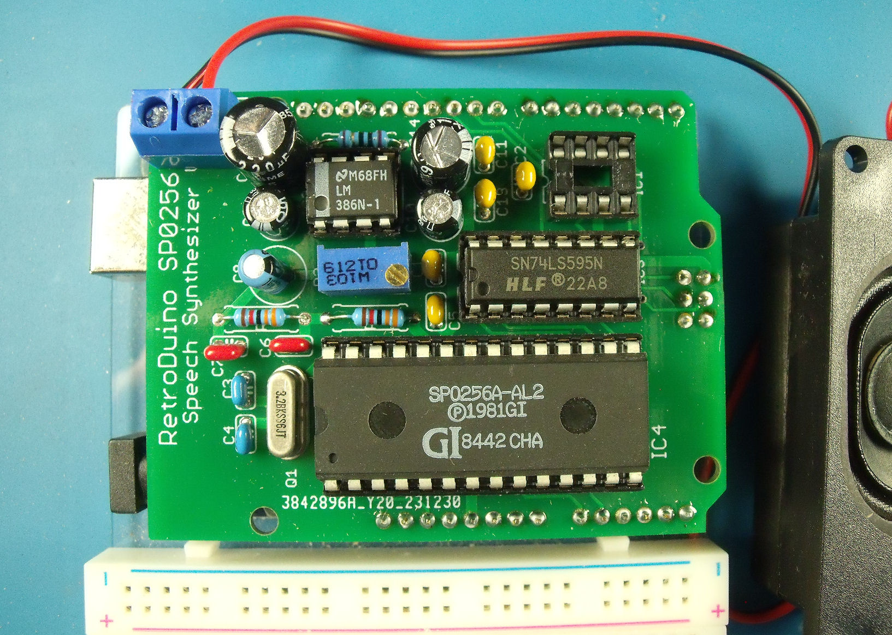

# Arduino UNO General Instruments SP0256-AL2 Shield
After playing with the National Semiconductor Digitalker IC, I got to remembering about another speech chip from my younger days. Way back when I owned a [NASCOM-2](https://en.wikipedia.org/wiki/Nascom) Z80 based machine, I also had a speech interface built around a GI SP0256-AL2 device that I hooked up to it. This is my spin on using the SP0256-AL2 chip with a modern-ish Arduino UNO board.

## Description

The aim of this project is to create a shield for an Arduino UNO to bring to life a General Instruments SP0256-AL2 speech IC and to additionall have some non-volatile storage to hold some [allophones](https://en.wikipedia.org/wiki/Allophone) for pre-defined words and phrases.

## Design

In order to speak a word (or phrase), the SP0256-AL2 needs to be passes a stream of allophones that when strung together sound like a word. The SP0256-AL2 has 64 allophones. The required allophone is presented on the pins A1..A8. In this design, A7 & A8 are grounded so only 6 bits are used from the shift register.

Once the required allophone has been presented, the ALD (Address Load) pin is pulsed low briefly. This loads the allophone into the SP0256-AL2 and starts the sound generation process.

The SP0256-AL2 sets the LRQ (Load Request) pin low when it is ready for the next allophone.

### Interface

I've chosen to use the SPI interface of the ATMEGA328P on the UNO and a single 74HCT595 serial-in / parallel-out shift register to transfer the allophone to the SP0256-AL2 chip.

I'm using the SPI signals MOSI and SCK from the ICSP header on the UNO rather than D11 and D13 in the hope that this board can also be used with an Arduino MEGA2560 as well. The SPI signals on the Arduino MEGA2560 board are on completely different pins, but they are also present on the ICSP header in the same physical location as on the UNO.

The SPI SS signal is routed to the D10 pin on the UNO, the Address Load is routed to the A1 pin on the UNO and the Load Request is routed to pin A0 on the UNO.

### Power

Unlike the Digitalker chip, the SP0256-AL2 runs from 5V which is sourced from the UNO board. 

### Audio

The audio circuitry is lifted directly from the SP0256-AL2 datasheet.

# The Arduino UNO Shield

An assembled shield (missing the EEPROM chip).

# Assembly

Start with the discrete components - there are a few resistors and capacitors which should be easy to hand solder. Then add the various IC sockets and the header pins.

The header pins are best inserted into the Arduino UNO board first and then the shield placed on to of them. That way all the headers will be vertical and mate up with the UNO sockets properly.

When you've installed all the basic components, and before fitting any chips, check that you have 5V on the VCC pins of the SP0256-AL2, 74HCT595 and 25LC256.

Install the SP0256-AL2, 74HCT595 and the 25LC256 EEPROM. 

# Speaking the first words

I've created a simple test sketch that you can use to send any of the allophones. It's in the code folder and called ALLOTEST. You can type in either the allophone number (0-63) or the allophone name. Multiple allophones can be generated - simply put a space between each allophone.
 As a start, the allophones for the word "hello" are:
 
> PA2 HH1 EH LL OW PA1

or

> 1 27 7 45 53 0

Note that the SP0256-AL2 needs a silence allophone such as PA1 at the end of a sequence otherwise it continues to output the last sound it made.

The test sketch also supports the upload of Intel-Hex records that are then programmed into the 25LC256 EEPROM. I've set the baud rate for the serial port to 9600 baud as there is no handshaking with the host and setting the baud rate too high will likely result in buffer overruns whilst waiting for the previous Intel-Hex record to be programmed into the EEPROM.

The sketch requires the EEPROM_SPI_WE library in order to write to the 25LC256 EEPROM. It can be installed via the Arduino library manager.

# Bored with trying to work out the required allophones yet?

I discovered a [software implementation of the CTS256 chip](https://github.com/GmEsoft/SP0256_CTS256A-AL2). The CTS256 chip is used to convertt plain ASCII character words into the required allophones that the SP0256-AL2 uses. The software can be compiled using the free version of Visual Studio. Once compiled, you can use the CTS256 simulator to produce the required allophones like this:

> CTS256A-AL2.exe hello
>
> CTS256A-AL2(tm) Emulator - v0.0.6-alpha
>
> PA2 HH1 EH LL OW PA3
>
> Conversion complete.

It's not perfect but it does provide a reasonable starting point for creating your own words.

Note that i've not tested every single word to see if it sounds intelligible. The allophones were generated from an emulation of the CTS256 chip and some will need tweeking to make them sound like the intended phrase.

# On-board vocabulary

The board also includes a 25LC256 EEPROM to store pre-defined sequences of allophones that can be read back and transferred to the SP0256-AL2 chip.

## Creating a library of words

It took a little bit of lateral thinking but I discovered that I could use the free online assembler at [ASM80.com](https://asm80.com) to create Intel Hex records.

I've included a sample library of quite a few words in the code folder called vocab_v1.0.asm. This plain text file can be pasted into a new file on asm80.com (I used the 8080 CPU type when creating the new file).

The layout of the EEPROM memory is detailed in the vocabulary file but I simply grouped the words so that all words starting with A are together and all words starting with B are together etc.

Starting at address 0002 are the pointers to all the words that begin with A. Starting at address 500 (that's 500 decimal) are the pointers to all the words that begin with B. Starting at address 1000 are the pointers to all the words that begin with C and so on.

That gives 500 bytes (or 250 pointers => 250 words) to store all the words beginning with a certain letter. 250 words should be enough!

If you want to add a new word, then simply tag it on to the end of the group of words with the same first letter. That way you don't need to adjust the number associated with any existing word. Well, not unless you end up with more than 250 words with the same first letter. 

The file is then saved and compiled to produce the Intel-Hex file.

## Programming the vocabulary into the EEPROM

I've created a simple test sketch that you can use to program the on-board EEPROM. Or you can use an external programmer to program the chip. The sketch is in the code folder and called EE_PROG.

With the sketch running, you can then upload the vocabulary using a terminal program such as TeraTerm. I used CoolTerm as it will display the output from the sketch as the upload progresses.

NOTE: I had to edit the Intel-Hex file generated by ASM80 to insert a final new line so that the end of file record was processed by the EEPROM programming sketch.

## Accesing the EEPROM vocabulary

I've created a simple sketch to recall the words in the vocabulary. The sketch is in the code folder and called EE_TEST.

To speak one of the stored phrases, just type in the phrase index number. To say the word OK, the index number is 3506 in the vocab v1.0 file.

There's very little error checking in the demonstration code.

# Further information

Have a look in the datasheets folder for information on the SP0256-AL2 chip and its companion, the CTS256. The SP0256-AL2 datasheet details the allophones as well as examples of their use in english words.

# Known errors

* The addition of a 10K pull up resistor on the ALD line stops spurious sounds whilst uploading sketches.

* There may be an issue with the code that handles the writing of the Intel-HEX data to the EEPROM. When trying to load the vocabulary Intel-Hex file using the EE_PROG sketch, the data sometimes got messed up such that only partial words were spoken. I've not figured out whether this is a problem with my code or the EEPROM library as the Intel-Hex file is correct.
 
# Releases

* 0.2
    * New demonstrations sketches
    * New large vocabulary file for the EEPROM
* 0.1
    * Initial Release

## License

This project is licensed under the GNU General Public License v3.0 - see the LICENSE.md file for details
